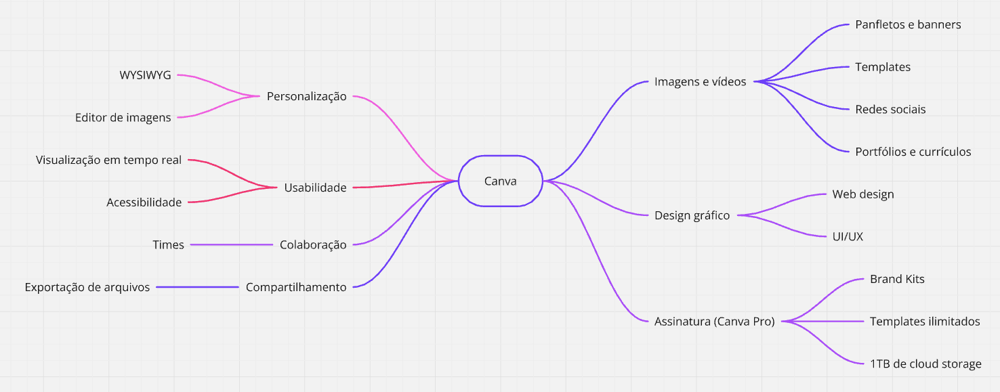

# Brainstorming

## Histórico de Versões

| Data       | Descrição             | Autor          | Versão |
|------------|-----------------------|----------------|--------|
| 31/07/2024 | Criação do documento. | Caio Alexandre | 0.0    |

## Origem

O desenvolvimento deste branstorming foi dado a partir da
[Reunião 1](../atas/reuniao1.md).

## Metodologia

Durante a reunião, o grupo se reuniu para identificar possíveis palavras-chave
e requisitos que melhor descrevem a plataforma Canva. A partir disso, foi
possível gerar uma lista **inicial** de requisitos que serão utilizados para
gerar o mapa mental. O objetivo desta lista é identificar os requisitos mais
elementares que definem a base da plataforma.

A partir do brainstorming, decidimos utilizar a técnica de MoSCoW e First Things
First para priorizar os requisitos identificados.

## Introdução

A ideia do brainstorming consiste em um grupo de pessoas se reunir para gerar
ideias e soluções para um problema específico. O brainstorming é uma técnica
muito utilizada em diversas áreas, como por exemplo, na área de desenvolvimento
de software. A partir dessa técnica, foi possível identificar os requisitos
necessários para o desenvolvimento do projeto, junto com a escolha de técnicas
para a priorização dos requisitos.

## Artefatos

### Requisitos Inicial

Os requisitos identificados durante o brainstorming foram:

* O sistema deve permitir o cadastro de usuários
* O sistema deve permitir a criação de imagens, panfletos, banners, etc.
* O usuário deve poder utilizar templates prontos
* O sistema deve permitir a exportação das imagens criadas
* O sistema deve permitir a edição das imagens criadas
* O sistema deve permitir a exclusão das imagens criadas
* O sistema deve permitir a visualização das imagens criadas
* O sistema deve permitir a personalização das imagens criadas

### Mapa Mental

Como resultado desta técnica, foi gerado um mapa mental contendo os requisitos
identificados durante o brainstorming. O mapa mental foi gerado utilizando a
ferramenta [Miro](https://miro.com/). A imagem do mapa mental pode ser
visualizada abaixo:

#### Versão 0.0

### Priorização dos Requisitos

As técnicas escolhidas foram o [MoSCoW](moscow.md) e
[First Things First](first_things.md).
