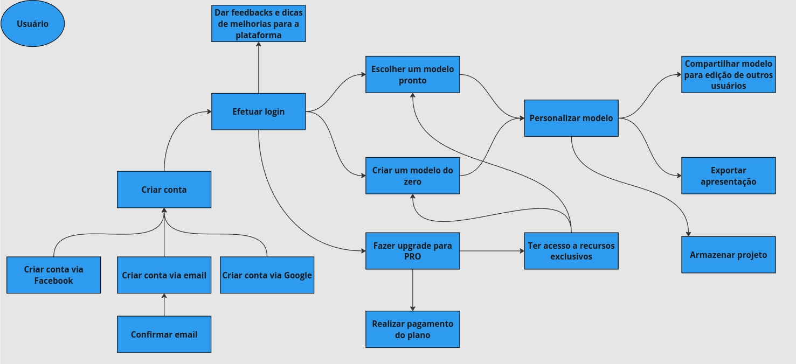
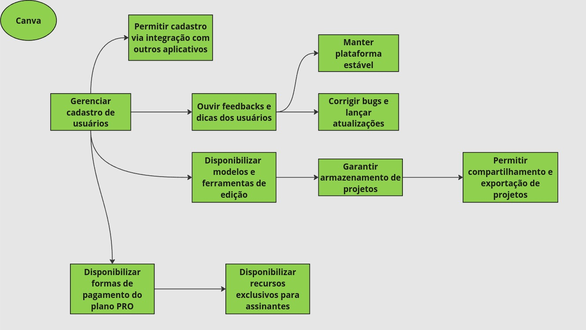
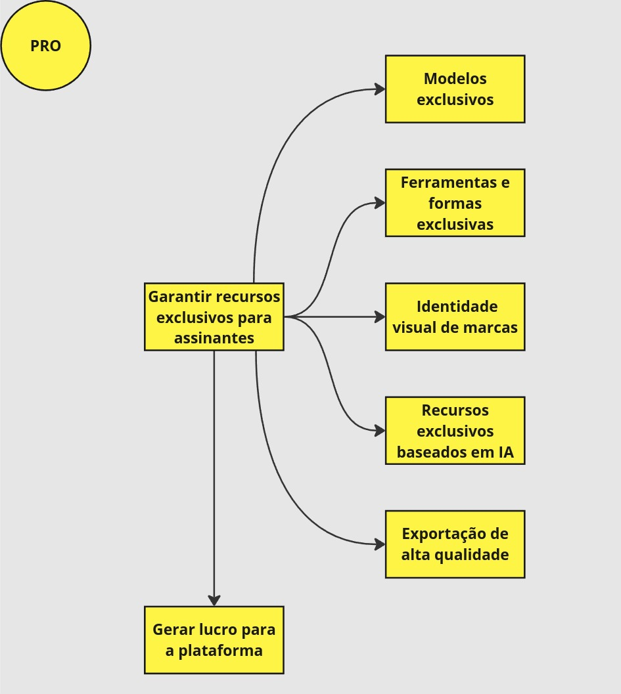

# iStar

## Introdução

O iStar (ou i*) é uma técnica de modelagem que ajuda a entender e representar as relações e dependências entre diferentes atores (como pessoas, sistemas ou organizações) dentro de um sistema ou projeto. Ele foca em identificar os objetivos dos atores, as tarefas que realizam para alcançá-los, e como esses atores dependem uns dos outros para atingir seus objetivos.

## Principais Atores

- Usuário
- Canva
- PRO

## Strategic Dependency Model (SD)

## Strategic Rationale Model (SR)

## SR Usuário

## SR Canva

## SR PRO

