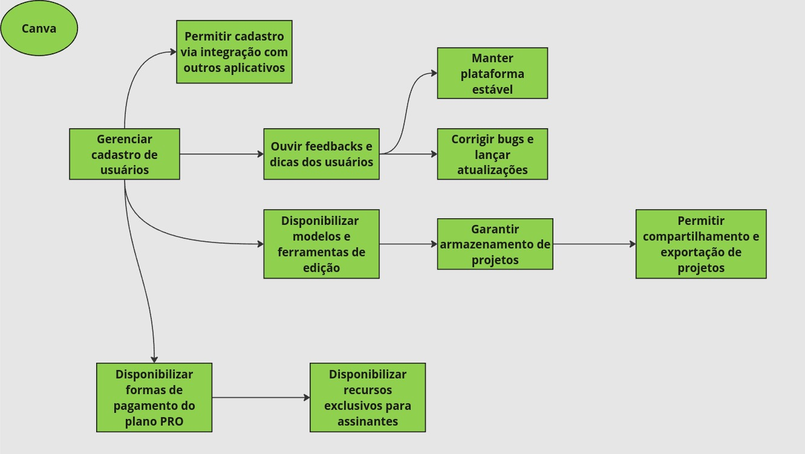
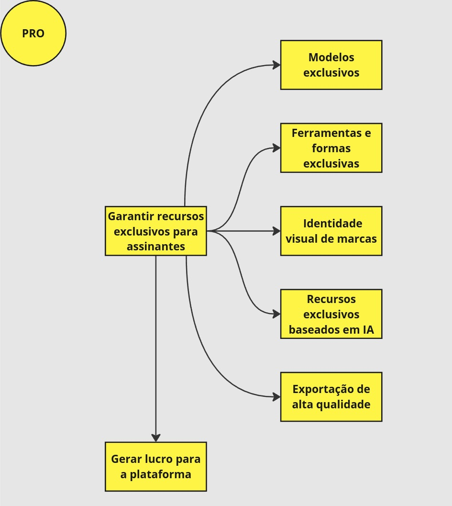

# iStar

|    Data    | Descrição | Autor | Versão |
|------------|--------|-----------|-------|
| 14/08/2024 |  Adição da versão inicial do iStar após introspecção durante navegação na plataforma e na Análise de Protocolo | Rodrigo Mattos | 1.0 |

!!! warning "Em construção"

    Este documento ainda está em construção e não deve ser considerado como
    versão final para esta release.

## Introdução

O iStar (ou i*) é uma técnica de modelagem que ajuda a entender e representar as relações e dependências entre diferentes atores (como pessoas, sistemas ou organizações) dentro de um sistema ou projeto. Ele foca em identificar os objetivos dos atores, as tarefas que realizam para alcançá-los, e como esses atores dependem uns dos outros para atingir seus objetivos.

## Principais Atores

- Usuário
- Canva
- PRO

## Strategic Dependency Model (SD)

## Strategic Rationale Model (SR)

## SR Usuário

## SR Canva

## SR PRO

