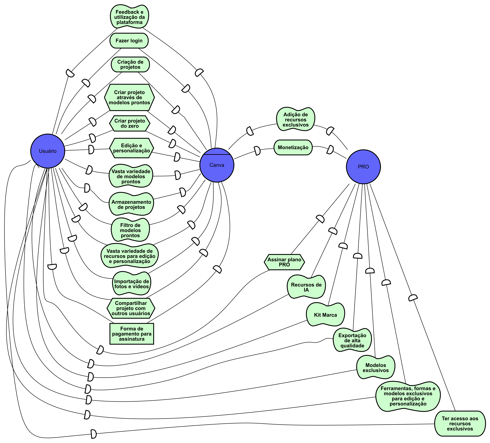

# iStar

|    Data    | Descrição                          | Autor          | Versão |
|------------|------------------------------------|----------------|--------|
| 14/08/2024 | Adição da versão inicial do iStar. | Rodrigo Mattos | 0.0    |
| 02/09/2024 | Melhoria dos diagramas SD e SR.    | Rodrigo Mattos | 0.1    |
| 09/09/2024 | Correção dos diagramas SD e SR.    | Rodrigo Mattos | 0.2    |

## Origem

O desenvolvimento deste iStar foi dado inicialmente a partir da
[Análise de Protocolo](../elicitacao/analise_protocolo.md) feita na parte da
elicitação e após introspecção durante navegação na plataforma Canva.

## Metodologia

O desenvolvimento do iStar foi feito inicialmente com a identificação
dos principais atores e agentes envolvidos no sistema. Em seguida, foi feita a modelagem
dos diagramas SD e SR explicando as dependências entre os atores e as
tarefas e objetivos de cada ator. Posteriormente o documento foi
revisado pelo Caio.

## Introdução

O iStar (ou i*) é uma técnica de modelagem que ajuda a entender e representar as
relações e dependências entre diferentes atores (como pessoas, sistemas ou
organizações) dentro de um sistema ou projeto. Ele foca em identificar os
objetivos dos atores, as tarefas que realizam para alcançá-los, e como esses
atores dependem uns dos outros para atingir seus objetivos.

## Artefatos

### Principais Atores/Agentes

- Usuário
- Canva
- PRO

### Strategic Dependency Model (SD)

### Strategic Rationale Model (SR)

#### SR Usuário

#### SR Canva

#### SR PRO

