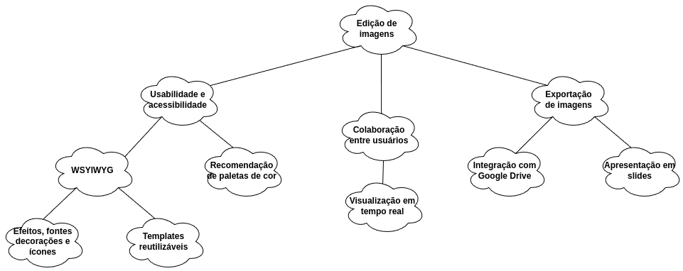
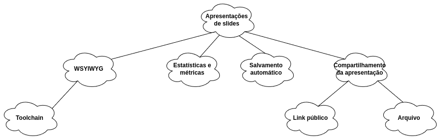

# NFR Framework

| Data       | Descrição                                  | Autor          | Versão |
|------------|--------------------------------------------|----------------|--------|
| 17/08/2024 | Desenvolvimento inicial dos NFR Frameworks | Caio Alexandre | 1.0    |

O NFR é um framework orientado a metas, que busca representar requisitos não funcionais
de um sistema de software. Desse modelo é abstraído um diagrama formado por softgoals
(requisitos de qualidade), operacionalização, argumentação, impactos e legenda.

## NFR1 - Edição de Imagens

### Versão 1.0

## NFR2 - Apresentação de Slides

### Versão 1.0

