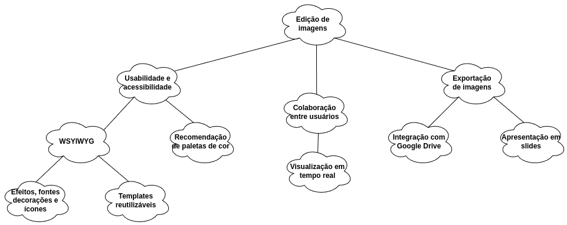
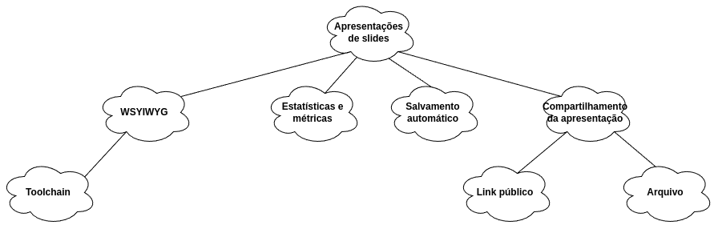

# NFR Framework

## Histórico de Versões

| Data       | Descrição                                   | Autor          | Versão |
|------------|---------------------------------------------|----------------|--------|
| 17/08/2024 | Desenvolvimento inicial dos NFR Frameworks. | Caio Alexandre | 0.0    |

O NFR é um framework orientado a metas, que busca representar requisitos não
funcionais de um sistema de software. Desse modelo é abstraído um diagrama
formado por softgoals (requisitos de qualidade), operacionalização,
argumentação, impactos e legenda.

## Origem

O desenvolvimento deste NFR Framework foi dado a partir da
[Reunião 5](../atas/reuniao5.md).

## Metodologia

O desenvolvimento do NFR Framework foi feito primeiramente com a identificação
dos requisitos não funcionais do sistema. Em seguida, foi feita a modelagem
primeiramente pelo Caio, que posteriormente foi revisada e melhorada pelo
Rodrigo (houve um *swap* de tarefas).

## NFR1 - Edição de Imagens

### Versão 0.0

## NFR2 - Apresentação de Slides

### Versão 0.0

