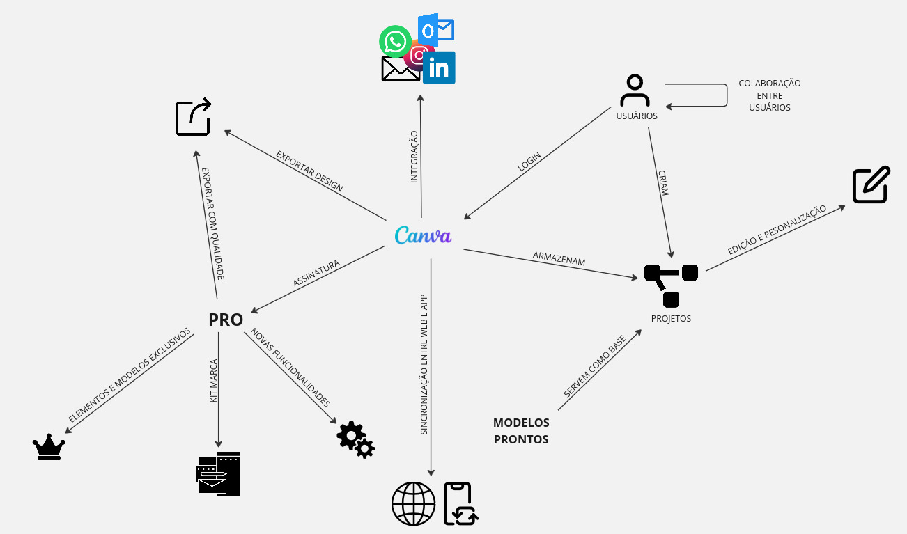
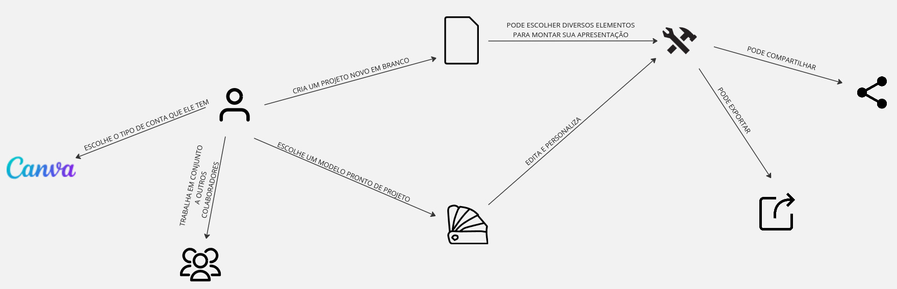

# Rich Picture

## Histórico de Versões

| Data       | Descrição                     | Autor       | Versão |
|------------|-------------------------------|-------------|--------|
| 24/07/2024 | Rich Picture geral.           | Luiza Maluf | 0.0    |
| 24/07/2024 | Rich Picture Foco no usuário. | Luiza Maluf | 0.1    |

## Origem

O desenvolvimento deste Rich Picture foi dado a partir da
[Reunião 1](../atas/reuniao1.md).

## Introdução

Um **Rich Picture** é uma ferramenta visual utilizada para representar de forma
holística e intuitiva um sistema complexo ou uma situação problemática.
Originado na abordagem de Soft Systems Methodology (SSM) desenvolvida por Peter
Checkland, o Rich Picture é caracterizado por ser uma representação gráfica que
inclui pessoas, processos, fluxos de informação, relacionamentos e contextos.

## Características Principais

- **Visual e Intuitivo**: Utiliza desenhos, símbolos, ícones e texto para
  capturar e comunicar aspectos importantes do sistema.
- **Holístico**: Oferece uma visão abrangente do sistema ou problema,
  considerando múltiplas perspectivas e interações.
- **Flexível**: Pode ser continuamente refinado e ajustado à medida que novas
  informações são obtidas.
- **Colaborativo**: Frequentemente criado em grupos, promovendo a participação e
  a comunicação entre stakeholders.

## Objetivos

* **Compreensão**: Ajudar a entender complexidades e dinâmicas de sistemas.
* **Comunicação**: Facilitar a comunicação entre diferentes partes interessadas.
* **Identificação de Problemas**: Destacar áreas problemáticas e oportunidades
  de melhoria.
* **Planejamento**: Apoiar na elaboração de estratégias e soluções.

## Utilização

Rich Pictures são amplamente usados em diversas áreas, incluindo engenharia de
sistemas, gestão de projetos, análise de negócios e desenvolvimento
organizacional, devido à sua capacidade de simplificar e visualizar
complexidades.

Em resumo, um Rich Picture é uma ferramenta poderosa para explorar, comunicar e
resolver problemas complexos de maneira visual e colaborativa.

## Artefatos

### Fluxo Geral

#### Versão 0.0

### Fluxo do Usuário

#### Versão 0.0

