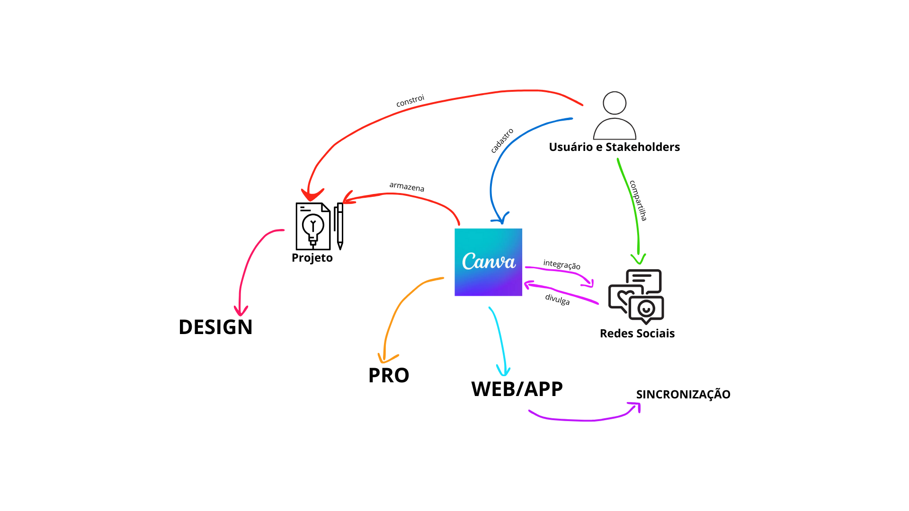
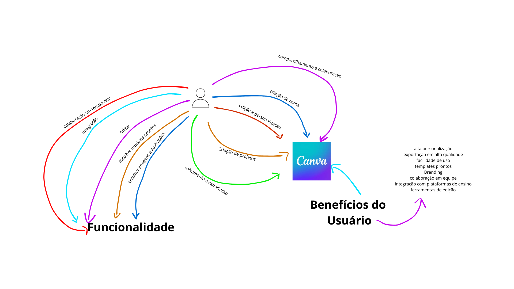

# Rich Picture do Aplicativo Canva

## Rich Picture Geral

## Rich Picture Com Foco no Usuário

## Rich Picture Com Foco nas Funcionalidades

### 3. Funcionalidades do Canva:
- **Editor de Arrastar e Soltar**: Facilita a criação de designs.
- **Modelos Pré-Definidos**: Disponíveis para diversas categorias.
- **Banco de Imagens e Ilustrações**: Milhões de opções de mídia.
- **Ferramentas de Texto**: Diversas fontes e estilos de texto.
- **Colaboração em Tempo Real**: Permite que múltiplos usuários editem um projeto simultaneamente.
- **Exportação/Compartilhamento**: Salva os designs em diferentes formatos e permite compartilhamento direto nas redes sociais.
- **Integrações**: Conexão com outras plataformas (Google Drive, Dropbox, redes sociais).

